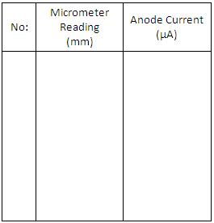

## Procedure

### Apparatus:
 

Ultrasonic interferometer, sample liquids, high frequency generator etc.

<h2>Procedure for Performing Real Lab:</h2>

- Insert the quartz crystal in the socket at the base and clamp it tightly with the help of a screw provided on one side of the instrument.
- Unscrew the knurled cap of the cell and lift it away. Fill the middle portion with the experimental liquid and screw the knurled cap tightly.
- Then connect the high frequency generator with the cell.
- There are two knobs on the instrument — "Adj" and "Gain". With "Adj", the position of the needle on the ammeter is adjusted. The knob "Gain" is used to increase the sensitivity of the instrument.
- Increase the micrometer setting till the anode current in the ammeter shows a maximum.
- Note down the micrometer reading.
- Continue to increase the micrometer setting, noting the reading at each maximum. Count any number of maxima and call it as <em>n</em>. Subtract the reading at the first maximum from the reading at the last maximum. This will make the measurement accurate and we can say, <strong>d = D / (n - 1)</strong>.
- Note down this value as,

$$D=\frac{(n-1)\lambda}{2}$$

- Then calculate the velocity of wave through the medium as,

$$v=\lambda f=\frac{2Df}{(n-1)}$$

- Knowing the density of the medium, the adiabatic compressibility can be calculated using the equation,

$$\beta=\frac{1}{\rho v^2}$$

<h2>Procedure for Performing the Simulator:</h2>

<ul>
  <li>From the combo box <strong>Choose medium</strong>, select the desired experimental liquid.</li>

  <li>Using the slider <strong>Frequency of wave</strong>, set the frequency of the ultrasonic sound used. A lower frequency will give a longer wavelength, which is easier to measure accurately.</li>

  <li>Switch ON the frequency generator using the <strong>Power on</strong> button.</li>

  <li>Adjust the <strong>GAIN</strong> and <strong>ADJ</strong> knobs such that the <strong>ADJ</strong> value is greater than the <strong>GAIN</strong> value.</li>

  <li>At this micrometer setting, the ammeter will show a maximum. Do not record the micrometer reading at this maximum. It could be inaccurate because the first maximum should be at zero and the micrometer cannot be set to zero.</li>

  <li>In the simulator, right and left arrows are provided to increase or decrease the micrometer distance. Increase the micrometer setting till the anode current in the ammeter shows a new maximum.</li>

  <li>(After the first few clicks, if you click and hold the arrow, the micrometer setting will increase continuously. A single click increases it by a small increment.) Note down the micrometer reading at the new maximum.</li>

  <li>Stop when you have recorded micrometer readings for 10 or more maxima.</li>

  <li>The distance between the adjacent maxima is calculated. From the equations, one can calculate the velocity of sound waves through the medium and also the adiabatic compressibility of the liquid can be calculated.</li>

  <li>A <strong>Show cross-section</strong> button is provided to see the cross section of the interferometer cell. The graph can be displayed using the button <strong>Show graph</strong> if needed.</li>

  <li><strong>Show result</strong> button displays the result after doing the experiment.</li>
</ul>

  

 

<h2>Observations:</h2>

<ul>
  <li>Least count of the micrometer: .......... mm</li>
  <li>Frequency of the ultrasound used (<em>f</em>): .......... Hz</li>
  <li><em>n</em> = .......... , <em>D</em> = .......... mm</li>
  <li><em>v</em> = .......... m/s</li>
</ul>

<h2>Result:</h2>

<ul>
  <li>The velocity of the ultrasonic wave through the given liquid medium = ......................... m/s</li>
  <li>The adiabatic compressibility of the given liquid medium = ......................... m²/N</li>
</ul>

