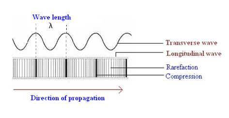
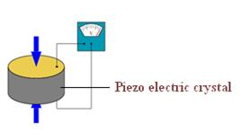
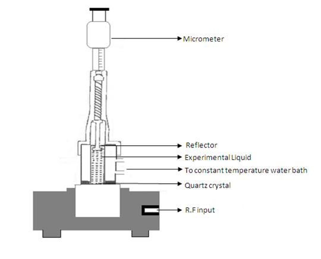

## Theory

Ultrasonic interferometer is a simple device which yields accurate and consistent data, from which one can determine the velocity of ultrasonic sound in a liquid medium.

<iframe width="560" height="315" src="https://www.youtube.com/embed/MD_zkNzF3eA" title="YouTube video player" frameborder="0" allow="accelerometer; autoplay; clipboard-write; encrypted-media; gyroscope; picture-in-picture; web-share" referrerpolicy="strict-origin-when-cross-origin" allowfullscreen></iframe>

### Ultrasonics:

  

 

Ultrasonic sound refers to sound pressure with a frequency greater than the human audible range (20Hz to 20 KHz). When an ultrasonic wave propagates through a medium, the molecules in that medium vibrate over very short distance in a direction parallel to the longitudinal wave. During this vibration, momentum is transferred among molecules. This causes the wave to pass through the medium.

### Generation of ultrasound:
 

Ultrasonic can be produced by different methods. The most common methods include:

 

Mechanical  method:   In this, ultrasonic frequencies up to 100 KHz are produced. But this method is rarely used due to its limited frequency range.

  

 

**Piezoelectric generator**:    This is the most common method used for the production of ultrasound. When mechanical pressure is applied to opposite faces of certain crystals which are cut suitably, electric fields are produced. Similarly, when subjected to an electric field, these crystals contract or expand, depending on the direction of the field. Thus a properly oriented rapid alternating electric field causes a piezoelectric crystal to vibrate mechanically. This vibration, largest when the crystal is at resonance, is used to produce a longitudinal wave, i.e., a sound wave.

 

 

**Magnetostriction generator**:   In this method, the magnetostriction method is used for the production of ultrasonic. Frequencies ranging from 8000 Hz to 20,000Hz can be produced by this method.

  <h2>Ultrasonic Interferometer:</h2>

  
  

 

  
The schematic diagram of an ultrasonic interferometer is shown in the figure.

  
In an ultrasonic interferometer, the ultrasonic waves are produced by the piezoelectric method. In a fixed frequency variable path interferometer, the wavelength of the sound in an experimental liquid medium is measured, and from this one can calculate its velocity through that medium.

  
The apparatus consists of an ultrasonic cell, which is a double walled brass cell with chromium plated surfaces having a capacity of 10ml. The double wall allows water circulation around the experimental medium to maintain it at a known constant temperature.

  
The micrometer scale is marked in units of 0.01mm and has an overall length of 25mm. Ultrasonic waves of known frequency are produced by a quartz crystal which is fixed at the bottom of the cell. There is a movable metallic plate parallel to the quartz plate, which reflects the waves.

  
The waves interfere with their reflections, and if the separation between the plates is exactly an integer multiple of half-wavelengths of sound, standing waves are produced in the liquid medium. Under these circumstances, acoustic resonance occurs. The resonant waves are a maximum in amplitude, causing a corresponding maximum in the anode current of the piezoelectric generator.

  
If we increase or decrease the distance by exactly one half of the wavelength (λ/2) or an integer multiple of one half wavelength, the anode current again becomes maximum.

  
If <em>d</em> is the separation between successive adjacent maxima of anode current, then,

  $$d=\frac{\lambda}{2}$$

  
We have, the velocity (<em>v</em>) of a wave is related to its wavelength (λ) by the relation:

$$v = f \times \lambda$$
where $f$ is the frequency of the wave.

Then,

$$v=\lambda f=2df$$

The velocity of ultrasound is determined principally by the compressibility of the material of the medium. For a medium with high compressibility, the velocity will be less.

Adiabatic compressibility of a fluid is a measure of the relative volume change of the fluid as a response to a pressure change. Compressibility is the reciprocal of bulk modulus, and is usually denoted by the Greek letter beta (β).

The adiabatic compressibility of the material of the sample can be calculated using the equation:

$$\beta = \frac{1}{(\rho \times v^2)}$$

where:

<ul>
  <li> $\beta$ is the adiabatic compressibility of the medium</li>
  <li> $\rho$ (rho) is the density of the medium</li>
  <li> $v$ is the velocity of ultrasound in the medium</li>
</ul>

 

